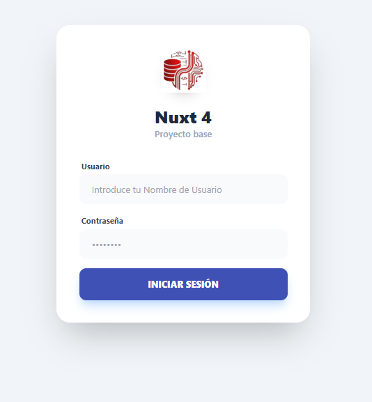
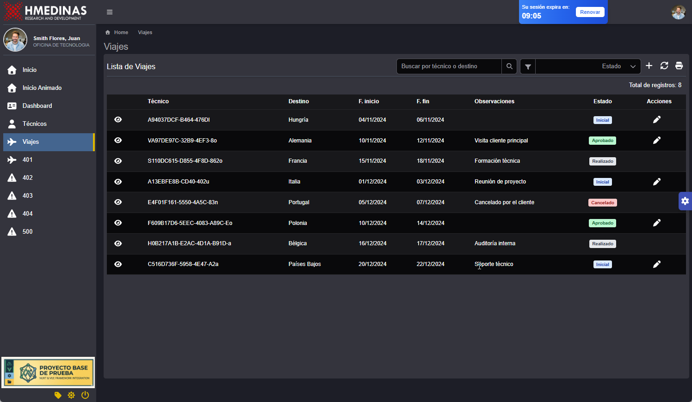
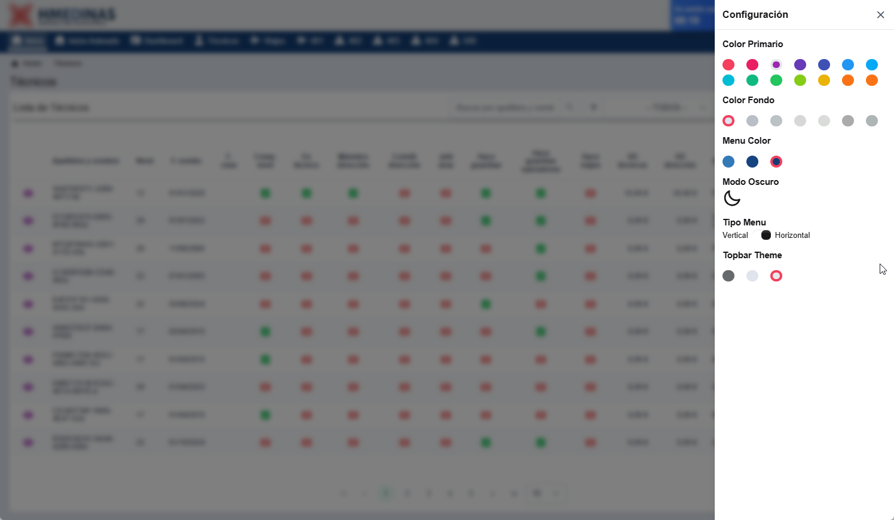
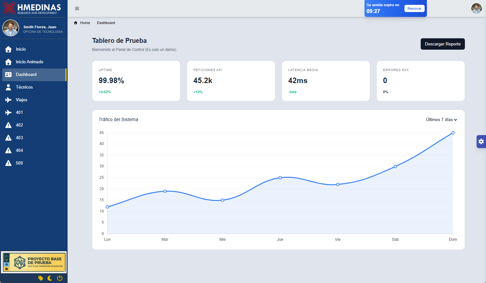
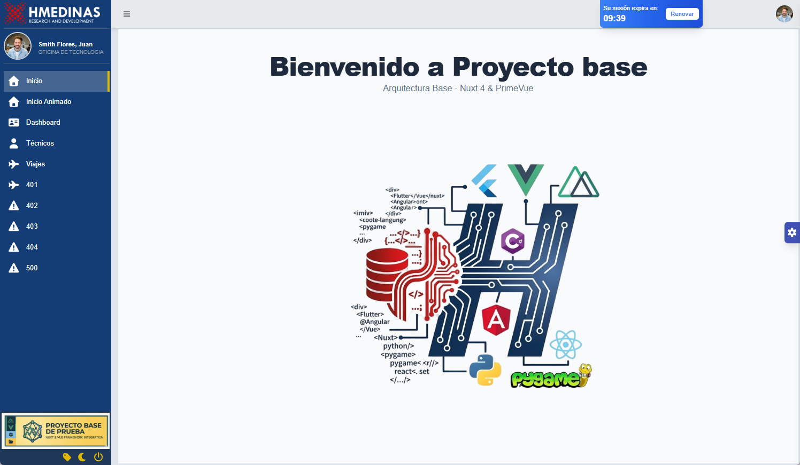
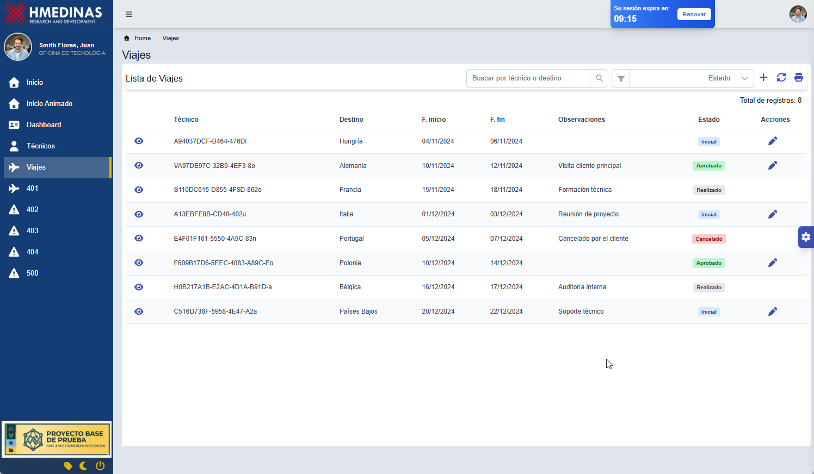
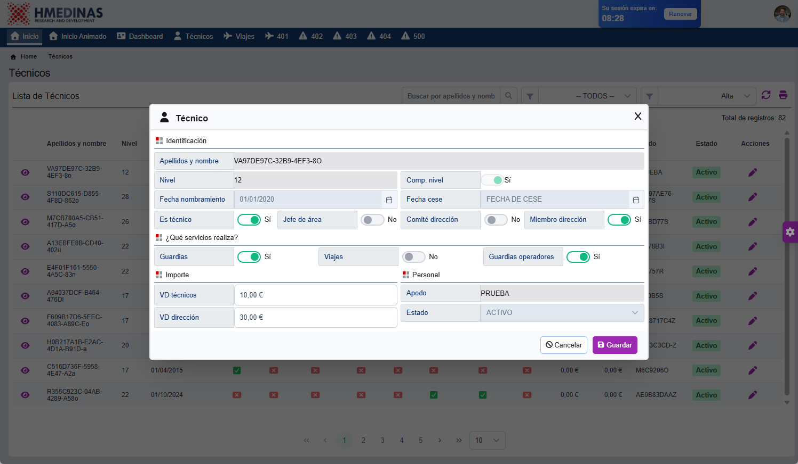

# 🚀 Proyecto Base Nuxt 4 (Última Generación)


Este es un "boilerplate" de alto rendimiento diseñado bajo los estándares de **Nuxt 4.** Aprovecha la nueva estructura de directorios y la optimización de módulos para aplicaciones SPA escalables.

## 🛠 Stack Tecnológico de Vanguardia
Para este proyecto estamos utilizando las versiones más recientes y estables:

------------
> -  **[Nuxt 4](https://nuxt.com/docs/getting-started/installation)** : Framework base utilizando la nueva estructura de directorios optimizada.
> -  **[Pinia](https://pinia.vuejs.org/ssr/nuxt.html)** :: Gestión de estado global con soporte nativo para SSR y Composition API.
> -  **[vueuse/core](https://www.npmjs.com/package/@vueuse/core)** : Colección de utilidades reactivas (gestión avanzada de localStorage y eventos del navegador).
> -  **[PrimeVue v4+:](https://primevue.org/nuxt/)** : uite de componentes UI rediseñada específicamente para ser compatible con el modo "Unstyled" y Tailwind CSS en Nuxt 4.
> -  **[PrimeVue/tailwindcss](https://tailwind.primevue.org/nuxt/)** : Integracion de estilos tailwindcss con PrimeVue.
> -  **[Tailwind CSS v4:](https://tailwindcss.com/docs/guides/nuxtjs)** : Motor de estilos de última generación para un diseño atómico y ultra rápido.
> -  **[daisyui](https://daisyui.com/docs/install/)** : Biblioteca de componentes basada en Tailwind para prototipado rápido.
> -  **[Docxtemplater](https://docxtemplater.com/docs/get-started-node/)**  : Motor de plantillas para exportación de reportes complejos en formato .docx
> - **⚠️ Bootstrap (En Evaluación)** : Se está analizando la compatibilidad con el nuevo sistema de carga de módulos de Nuxt 4.
------------

## 📂 Documentación y Guías
Para facilitar el desarrollo, consulta los manuales específicos:

- [📖 Guía de Instalación Nuxt 4](README_Instalacion.md).
- [🏗️ Nueva Arquitectura de Directorios](README_Estructura.md) (Explicación de la carpeta **app/** y todo sus configuracione especiales de nuxt 4).


## ⚙️ Configuración del Ecosistema (`app/config/config.json`)
La configuración central permite gestionar el comportamiento de la SPA y la integración con servicios de identidad.  **app/config/config.json**,

``` json
{
    // Parametros generales de la aplicacion
    "configuration": {
        "useMock": true,
        "version": "1.0.0",
        "settingColor":true
    },
    // Url para comunicacion con los servicios
    "apiservice":{
        "url":""
    },
    // Conexion de seguridad que se usara para el AUTH2
    "openid":{
        "authority": "https://local.service.com",
        "clientId": "clientId.prep",
        "responseType": "code",
        "scope": "openid profile",
        "filterProtocolClaims": true,
        "loadUserInfo": false,
        "automaticSilentRenew": true,
        "silentRequestTimeout": 1500,
        "accessTokenExpiringNotificationTime": 300
    },
    // puerto donde se utilizara la aplicacion
    "devServer": {
        "port": 3000
     }

}
```


## 🎨 Personalización de Temas y Colores
El sistema visual está profundamente integrado con Tailwind v4 y el motor de temas de PrimeVue.

### Configuración de Colores (**`tailwind.config.js`**)

Hemos extendido la paleta para soportar un diseño corporativo flexible:

- **Primary & Alternative:** Colores de marca y estados del sistema.

- **Application & Dark:** Colores semánticos para el layout (Sidebar, Topbar) y el modo oscuro avanzado.


```ts
 darkMode:  'class', // Activar el modo oscuro usando la clase 'dark'
  theme: {
    extend: {
      colors:{
        // Definir Colores Primarios
        primary: '#3F51B5',
        // colores alternativos que se utilizaran en la paleta de colores 
        alternative:{          
          red:{
            100 : '#f43f5e',
            200 : '#E91E63',
          },
          purple: {
            100 : '#9C27B0',
            200 : '#673AB7',
            300 : '#3F51B5',
          },
          blue:{
            100 : '#2196F3',
            200 : '#03A9F4',
            300 : '#00BCD4',
          },
          green: {
            100 : '#10b981',
            200 : '#22c55e',
            300 : '#84cc16'
          },
          yellow : '#eab308',
         
          orange : {
            100 : '#f97316',
            200 : '#f97316'
          },
        },
        // colores que puede usar la aplicacion en algunos lugares 
        application: {
          select: '',           
          blue:{
            100 : '#337ab7',
            300 : '#44658f',
            500 : '#154481',
            600 : '#133d74'
          },
          yellow: {
            100 : '#fde8d1',
            500 : '#e0b800'
          },
          silver: {
            800 : '#676a6c',
            300 : '#dfe4ed',
            100 : '#e7eaec'
          },
          green : '#1ab394',
          footer: '#2d313775'
        },
        // Puedes agregar más colecciones de colores si lo deseas
        dark :
          {
            panel: '#34343d',
            fondo : '#1d1e27',
            text : '#ffffff',
            textSecondary : '#a5a5a9'           
        },
        // fondos de la aplicaicon que pueden ser personalizados 
        fondo : {
          100 : '#dfe4ed',
          200 : '#babec6',
          300 : '#bac2c6',
          400 : '#a7a0a66e',
          500 : '#b1b4b078',
          600 : '#808080a8',
          700 : '#828f8fa8'
        },
      }
    },
  },

```

### Gestión Dinámica (**`store/colorStore.ts`**)

A través de Pinia, controlamos la experiencia de usuario:

los colores por defecto y configuracion por defecto de la alicacion estan en el archivo **store/colorStore.ts**

```ts
// Función que define el estado inicial
const initialPrimariColor = (): PrimaryColors => {
    return {
      
        buttonClassPrimary : 'bg-primary  text-white',       
        textClassPrimary :'text-primary'
    };
  };

const initialSettingApp = () : SettingApp =>{
  return {
    isMenuCollapsed : false,    
    isDark : false,    
    isMenuHorizontal : false,
    menuClass : "bg-application-blue-600",
    topbarClass : "bg-application-silver-100",
    fondoClass : "bg-fondo-100",
    primaryColor : "bg-primary"
  }
}
```

### 🎨 Configuración de Interfaz (Store)

La personalización de la interfaz se gestiona a través de los siguientes estados reactivos en la tienda de Pinia:

| Propiedad | Descripción |
| :--- | :--- |
| ↔️ **`isMenuCollapsed`** | Indica si el menú lateral está colapsado o expandido. |
| 🌙 **`isDark`** | Indica si está activo el modo oscuro en la interfaz. |
| 🗺️ **`isMenuHorizontal`** | Define la disposición del menú (Vertical u Horizontal). |
| 🏷️ **`topbarClass`** | Define la clase de color de fondo para la barra superior (Topbar). |
| 🖼️ **`fondoClass`** | Define la clase de color de fondo para el cuerpo de la aplicación. |
| 🎨 **`primaryColor`** | Define el color primario asignado a los componentes globales. |


Para Mayor detalle consulte toda la infromacion  

## 📸 Capturas de Pantalla

A continuación se muestran las interfaces principales de la aplicación desarrolladas con **Nuxt 4** y **PrimeVue**:

|Pantalla de Login |
| :---: |
|  |

| Modo Oscuro | Configuración de Colores |
| :---: | :---: |
|  |  |
| *Interfaz de autenticación integrada con OpenID* | *Panel dinámico para personalización de temas* |


| Dashboard Principal | Menu principal |
| :---: | :---: |
|  |  |

| Listado general | Popups |
| :---: | :---: |
|  |  |


